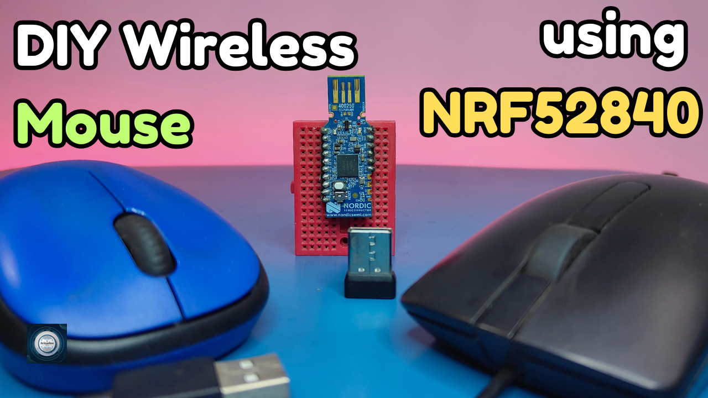
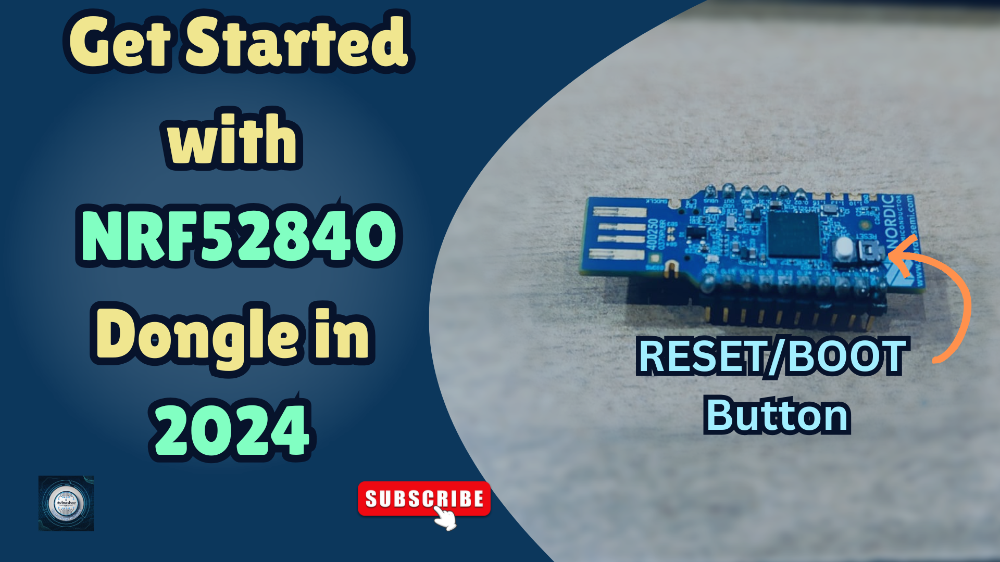

<h1 align="center">
  <a href="https://www.youtube.com/@eccentric_engineer">
	
  </a>  
</h1>

<h3 align="center">
	DIY Custom BLE Mouse using nRF52840 controller 
</h3>


  
## 📝 Overview

This project implements a Bluetooth Low Energy (BLE) HID Mouse using the nRF52 series (nRF52840 Dongle board).  
It turns your development board into a wireless mouse that can connect seamlessly to PCs, laptops, or mobile devices over BLE —   
no dongle or receiver required.

Perfect for embedded developers, hardware hackers, or DIY enthusiasts looking to build a custom BLE peripheral   
that acts as a fully functional HID mouse.

Platform used for firmware development is nRF Connect SDK on VSCode.  
Learn more 👇👇  
  
[](https://youtu.be/B3sBxbkTqs8)

## ✔️ Requirements

### 📦 Hardware
- nRF52840 Dongle (main controller  board)
- USB Female to Male Cable (optional, but recommended)
- Tactile button with cap  (mode selection - Previous and Next, execute movement functions - Up/Left and Bottom/Right) 

### 📂 Software
- VSCode (https://code.visualstudio.com/)  
- nRF Connect SDK (https://www.nordicsemi.com/Products/Development-software/nRF-Connect-SDK)
- nRF Connect for Desktop (https://www.nordicsemi.com/Products/Development-tools/nRF-Connect-for-Desktop)

## 🛠️ Installation and usage

```sh
git clone https://github.com/AvinasheeTech/nRF52-BLE-HID-Mouse.git
Open project in VSCode
Add Build Configuration -> Select nrf52840dongle_nrf52840 as board target -> Generate and Build
Open nRF Connect For Desktop App
Next Select Programmer -> Put Board in Bootloader mode -> Select Device -> Upload zephyr.hex output file from Build Directory of Project
Turn on Bluetooth on PC/Mobile Device -> Connect with Avinashee Tech Device -> Check for Connected Status with 100% Battery 
Enjoy...🍹
```
To learn more about how to upload code to nRF52840 Dongle using VSCode and nRF Connect SDK, click link below 👇👇  

[](https://youtu.be/TeBvb645NZA?si=z5goAc1ic0ipf2cX)


## ⭐️ Show Your Support

If you find this helpful or interesting, please consider giving us a star on GitHub. Your support helps promote the project and lets others know that it's worth checking out. 

Thank you for your support! 🌟

[](https://github.com/AvinasheeTech/nRF52-BLE-HID-Mouse/stargazers)
